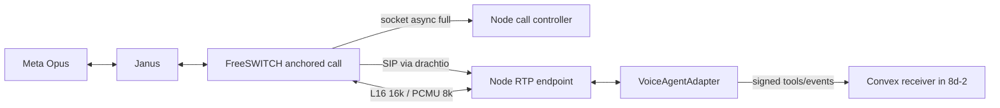

# Calling media gateway (wave 8b)

The `calling` Compose profile supplies Janus, FreeSWITCH, drachtio and a private Node controller.
Convex remains responsible for Meta webhooks, Graph signaling, call authorization and
tenant isolation. This task adds no Convex functions or dashboard screens. Use Graph
signaling with Meta's SIP mode **disabled**. All call legs stay on VoIP.

## Source builds and pins

| Component                        | Pin                                                                                                          | Official installation/reference                                                                                                                                                                                       |
| -------------------------------- | ------------------------------------------------------------------------------------------------------------ | --------------------------------------------------------------------------------------------------------------------------------------------------------------------------------------------------------------------- |
| Janus                            | 1.2.3, commit `a71f9cecb72b47fc3d3a7effc575ad6b21a1f4f4`                                                     | [Janus installation](https://janus.conf.meetecho.com/docs/README.html), [pinned README](https://github.com/meetecho/janus-gateway/blob/v1.2.3/README.md), [SIP plugin](https://janus.conf.meetecho.com/docs/sip.html) |
| FreeSWITCH                       | 1.11.3, commit `ef32e205295e29f034f1453ad245ba5efb07b94a`                                                    | [Official source/package installation](https://developer.signalwire.com/freeswitch/foundations/getting-started/), [release](https://github.com/signalwire/freeswitch/releases/tag/v1.11.3)                            |
| Sofia-SIP, both images           | 1.13.18, commit `ad36ac8f755308e8b87f98a505e83d4e408e5cc3`                                                   | [Official release](https://github.com/freeswitch/sofia-sip/releases/tag/v1.13.18)                                                                                                                                     |
| SpanDSP                          | 3.1.1 (ABI 4), commit `8f1e1646bdec99eac5fd2cd92c35563f736b9b89`                                             | [Official release](https://github.com/freeswitch/spandsp/releases/tag/v3.1.1), [FreeSWITCH dependency pin](https://github.com/signalwire/freeswitch/blob/v1.11.3/w32/spandsp-version.props)                           |
| Native image base                | Debian 12.11 slim, digest `sha256:b1a741487078b369e78119849663d7f1a5341ef2768798f7b7406c4240f86aef`          | [Official Debian image](https://hub.docker.com/_/debian)                                                                                                                                                              |
| Controller/harness base          | Node 22.17.0 bookworm slim, digest `sha256:b04ce4ae4e95b522112c2e5c52f781471a5cbc3b594527bcddedee9bc48c03a0` | [Official Node image](https://hub.docker.com/_/node)                                                                                                                                                                  |
| Package manager / fake Meta peer | pnpm 11.7.0 / werift 0.24.4                                                                                  | [pnpm](https://pnpm.io/installation), [werift](https://github.com/shinyoshiaki/werift-webrtc)                                                                                                                         |

The gateway architecture follows Meta's **FreeSWITCH using Graph API with Janus** example
in [integration examples](https://developers.facebook.com/documentation/business-messaging/whatsapp/calling/integration-examples).
The official FreeSWITCH install docs now live at `foundations/getting-started`; the
older `FreeSWITCH-Explained/Installation/Linux/Debian_67240088/` link redirects to the
manual home. Binary packages require a SignalWire Personal Access Token. Our source
build requires **no token**, builds Sofia and SpanDSP from fixed commits, selects a
small module list, and uses `bootstrap.sh`, `configure`, `make`, `make install`.
Janus uses the official `autogen.sh`, `configure`, `make`, `make install` sequence,
building only the SIP plugin and HTTP transport. Native Debian dependencies come
from the base image's Bookworm and security mirrors, authenticated by Debian's signed
repository metadata. The base digest and source commits are fixed; apt package versions
can change between builds.

Three changes to pinned Janus are in `docker/janus/meta-interop.patch`:

1. Always create a controlling, full-mode libnice agent. Janus 1.2.3 otherwise
   starts **controlled** when answering a remote offer. This image is dedicated
   to Meta ICE-lite peers; never use it as a general browser gateway.
2. Wait for ICE gathering to finish, removing the upstream five-second fallback
   that publishes partial candidates. Controller setup times out and destroys the
   session rather than returning an incomplete SDP.
3. Gate SIP-to-WebRTC RTP using the private `opensend_media` plugin message.
   The gate starts closed and opens only through `/route`. ICE/DTLS and RTCP may
   establish before routing; **RTP audio does not leave Janus** before routing.

FreeSWITCH's `ecdsa-dtls.patch` keeps valid P-256 certificates: upstream 1.11.3
compares every key's bit length to 4096 and regenerates an EC key as RSA. P-256
certificates are generated at startup for both media servers. WSS uses a separate
certificate from FreeSWITCH DTLS. Production WSS needs a publicly trusted hostname
certificate; self-signed DTLS certificates are expected and verified by SDP
fingerprints. Janus's DTLS certificate/key persist in `janus-certs`; rotate them
between calls, never during a call.

### FreeSWITCH 1.11 upgrade (8d-0)

Verified the [official release list](https://github.com/signalwire/freeswitch/releases)
and tag commits on 2026-10-02: v1.11.3 is the latest release. The
[1.11 release notes](https://github.com/signalwire/freeswitch/releases/tag/v1.11.0)
cover the PCRE2 migration and roughly 30 legacy module removals; 1.11.1–1.11.3
also include SIP, RTP/STUN, DTLS fingerprint and event-socket security fixes.
The token-free build still follows the official source installation sequence and
[tagged dependency build guide](https://github.com/signalwire/freeswitch/blob/v1.11.3/docker/build/base-image-from-source.Dockerfile).

The tagged [configure.ac](https://github.com/signalwire/freeswitch/blob/v1.11.3/configure.ac)
requires Sofia-SIP >= 1.13.18 and SpanDSP >= 3.1.1, so both source pins were bumped
(Sofia in both Janus and FreeSWITCH). SpanDSP now supplies `libspandsp.so.4`.
FreeSWITCH uses `libpcre2-dev` at build time and `libpcre2-8-0` at runtime.
There is no libks pin in this minimal image: the configure check accepts
libks2 >= 2.0.11 (or libks >= 1.8.2), but only requires it for `mod_verto` or
`mod_signalwire`, neither of which we build. Base-image digests remain as listed.
The P-256 certificate patch is still needed by the 1.11.3 certificate-size check.

Every configured module remains in the tagged
[module list](https://github.com/signalwire/freeswitch/blob/v1.11.3/build/modules.conf.in):

| Module                           | Purpose                                                |
| -------------------------------- | ------------------------------------------------------ |
| `mod_console`                    | Container logs                                         |
| `mod_commands`                   | ESL call and media controls                            |
| `mod_dptools`                    | Park, bridge, playback, digits and recording           |
| `mod_hash`, `mod_expr`           | Dialplan helpers                                       |
| `mod_opus`                       | Opus media                                             |
| `mod_sndfile`, `mod_tone_stream` | WAV prompts/recordings and generated tones             |
| `mod_event_socket`               | Private ESL                                            |
| `mod_xml_curl`                   | Ephemeral agent/gateway directory, loaded before Sofia |
| `mod_sofia`                      | SIP and agent WSS                                      |
| `mod_dialplan_xml`               | XML dialplan execution                                 |
| `mod_http_cache` (added)         | Cached HTTP(S) IVR prompts and `http_prefetch`         |

`mod_http_cache` is built and loaded with an explicit `http_cache.conf`, based on
the [upstream configuration](https://github.com/signalwire/freeswitch/blob/v1.11.3/conf/vanilla/autoload_configs/http_cache.conf.xml).
Use `http_cache://https://HOST/PROMPT.wav` for prompts and `http_prefetch` to warm
the cache. HTTPS verifies both certificate and hostname using Debian's system CA
bundle. Cache files live in `/opt/freeswitch/cache/http`, owned by the unprivileged
FreeSWITCH user; they are disposable and recreated on container replacement.
Direct `http://`/`https://` file formats remain disabled; `http_cache://` is available.
`mod_httapi` is not required and is not added. The existing demo still uses local WAVs;
the IVR engine and prompt generation belong to later 8d tasks.

Rebuild both native images, restart between calls, then run both harness commands
below. Operators moving from 1.10.12 should check custom dialplan regular expressions
against PCRE2 and custom module selections against the removal list. This repository's
module selections and existing call paths are covered by the 1.11.3 verification below.

## Configuration and operation

Set these in an uncommitted `.env.calling` or the shell:

```dotenv
CALL_GATEWAY_SECRET=<random 64-character hex secret>
JANUS_API_SECRET=<different random 64-character hex secret>
FREESWITCH_ESL_SECRET=<different random 64-character hex secret>
FREESWITCH_SIP_SECRET=<different random 64-character hex secret>
FREESWITCH_DIRECTORY_SECRET=<different random 64-character hex secret>
DRACHTIO_SECRET=<different random 64-character hex secret>
CALL_GATEWAY_CONVEX_HTTP_URL=http://convex:3211
JANUS_STUN_SERVER=stun.l.google.com
JANUS_STUN_PORT=19302
JANUS_PUBLIC_IP=<public IPv4 for 1:1 NAT, otherwise leave empty>
FREESWITCH_PUBLIC_IP=<public IPv4 for browser RTP>
```

Secrets must contain 32–128 alphanumeric, underscore or hyphen characters. Use
`openssl rand -hex 32` for each. Blank secrets fail at service startup; they do not
break Compose parsing when `calling` is not selected. The Convex HTTP site URL is
port **3211**, not its query/action API port 3210. Hosted deployments can set an
HTTPS site base URL instead. There must be a network path from Convex Node actions
to the controller. Self-hosted actions use `http://call-gateway:8090`; hosted
actions require a separately secured HTTPS reverse proxy to this private service.

Build/start the media services without starting the app or deploying Convex:

```sh
docker compose --env-file .env.calling --profile calling build janus freeswitch drachtio call-gateway
docker compose --env-file .env.calling --profile calling up -d janus freeswitch drachtio call-gateway
curl --fail http://127.0.0.1:8090/healthz
docker compose --env-file .env.calling --profile calling logs --tail=100 janus freeswitch call-gateway
```

Compose initializes named-volume ownership for the unprivileged image users.
For a trusted WSS certificate, override the FreeSWITCH `/certs` mount with a host
directory containing `wss.pem` (private key followed by full certificate chain),
readable by UID 10002. Set `FREESWITCH_CERT_DIR` to that host directory, or use a
read-only mount override and provide that file before starting. The default
self-signed WSS certificate is for localhost development with explicit trust.
The browser softphone registers over `wss://calling.example.com:7443`, authenticates
as an extension `2000`–`2099`, with SIP realm/domain `freeswitch`. Supply agent
credentials only to authorized agents in task 8c. The directory is fetched over private HTTP from the controller via
`mod_xml_curl`, using the separate `FREESWITCH_DIRECTORY_SECRET`. Convex's 8c
session action issues ephemeral credentials through the controller's HMAC API;
there is no shared browser password or static fallback. See
[browser deployment](browser-softphone.md) for the security design and upgrade steps. Gateway slots `1000`–`1099` use a distinct
secret and are never exposed as browser accounts.

### Network and firewall

| Port                          | Scope                                  | Purpose                                                                |
| ----------------------------- | -------------------------------------- | ---------------------------------------------------------------------- |
| UDP 20000–20199               | Publish to Meta / VPS firewall         | Janus ICE, DTLS-SRTP, RTCP mux; one audio stream per call              |
| UDP 20200–20399               | Docker network only                    | Janus SIP plugin's SDES-SRTP/RTCP towards FreeSWITCH                   |
| UDP 20400–20799               | Publish to agents / VPS firewall       | FreeSWITCH media for browser agents; also used internally for SIP legs |
| TCP 7443                      | Publish to agents                      | SIP-over-WSS; trusted certificate required                             |
| UDP/TCP 5060                  | Docker network only                    | SIP registration/invites between Janus and FreeSWITCH                  |
| TCP 8021                      | Docker network only                    | FreeSWITCH ESL, password + private-network ACL                         |
| TCP 8088 / 7088               | Docker network only                    | Janus HTTP / Admin API, API shared secret                              |
| TCP 8090                      | Docker network + loopback host mapping | HMAC-authenticated controller; read-only health probe unsigned         |
| UDP 19302 outbound by default | STUN service                           | Janus public candidate discovery; configurable server/port             |

Keep media UDP mappings **1:1**, including port numbers. For a VPS behind 1:1 NAT,
set `JANUS_PUBLIC_IP` and forward the Janus range; private candidates are retained
for peers on the Compose network. STUN allows Janus to initiate outbound ICE checks
through NAT, but does not fix blocked UDP or arbitrary symmetric NAT. No Meta TURN
server exists. For restrictive browser-agent networks, optional coturn is enabled separately with `calling-turn` and configured
on the agent's `RTCPeerConnection`, not on Meta's side (see below). On Docker Desktop,
the local harness uses container host candidates on the shared network and disables
STUN; it does not validate public NAT/firewall behavior.

Opus/48000/2 at 20 ms is used on the Meta/Janus SIP leg and browser agent legs.
The private Path B bot leg uses mono L16/16000 with PCMU/8000 fallback; FreeSWITCH
transcodes between these legs.
`telephone-event/8000` is an optional DTMF payload retained when offered, so IVR
digits work without adding a second speech codec. Video and data m-lines are
rejected, G.711/RED/RTX are removed, Opus DTX is disabled, and FreeSWITCH uses
the soft RTP timer to send media without waiting for the caller. Janus uses regular
ICE nomination, ICE-full controlling, P-256 DTLS certificates and a DTLS client role.
Local answers advertise `setup:active`; outbound offers use `actpass` and require
Meta's answer to choose `passive`. No trickle requests, updates, ICE restarts or
WebRTC renegotiation are issued. Local SDP contains complete candidates and
`end-of-candidates`, with exactly one audio m-line and at most one SSRC.

## Internal API (calling-core contract)

All five operations are HTTP POST with JSON, signed using `CALL_GATEWAY_SECRET`.
The API is private; callers must apply team/call ownership checks first. `callId`
is a stable Convex call-row id chosen before outbound Graph `connect`, so it need
not change when Meta assigns a wacid. It must match `[a-zA-Z0-9._:-]{1,256}`.

| Path            | Request                                                                         | Success (200)   |
| --------------- | ------------------------------------------------------------------------------- | --------------- |
| `/inbound`      | `{ callId, offerSdp }`                                                          | `{ answerSdp }` |
| `/outbound`     | `{ callId }`                                                                    | `{ offerSdp }`  |
| `/remoteAnswer` | `{ callId, sdp }`                                                               | `{ ok: true }`  |
| `/hangup`       | `{ callId }`                                                                    | `{ ok: true }`  |
| `/route`        | `{ callId, target: "agent" \| "ivr" \| "queue" \| "bot", extension?, record? }` | `{ ok: true }`  |

`agent` requires a local `2000`–`2099` extension. `ivr` runs the bundled spoken
demo (1: tone, 2: repeat) through the async/full outbound ESL controller. `record: true` starts a mixed mono WAV in
`/recordings/<FreeSWITCH UUID>.wav` before the route plays/bridges. `queue` returns **501 ROUTE_NOT_IMPLEMENTED**. `bot` now supports only the opt-in
8d-1 fake adapter through Path B; provider adapters arrive in 8d-2.
`outbound()` registers a per-call Janus SIP slot and uses FreeSWITCH ESL to originate
an Opus/SDES-SRTP `user/<slot>@freeswitch` leg. Its SIP INVITE becomes the Janus
WebRTC offer. `remoteAnswer()` applies the Meta answer with Janus SIP `accept`.
Both directions park their FreeSWITCH leg until `route()` decides the endpoint.

UIC integration sequence:

1. Call `inbound(offerSdp, callId)`. Store the returned SDP; duplicate requests with
   the same id/offer return the same answer.
2. Optionally send Graph `pre_accept` with that answer. Use the same answer for
   Graph `accept`. The controller still blocks outgoing RTP.
3. **Only after Graph `accept` returns 200**, call `route()` to release RTP and
   connect the agent or IVR. Do not call it merely on `answer_ready` or `media_up`.
4. On rejection, remote terminate, action failure or acceptance timeout, invoke
   `hangup()`. Convex also sends Graph `terminate` as appropriate.

BIC integration sequence: `outbound(callId)` → Graph `connect` with `offerSdp` →
connect webhook's SDP answer → `remoteAnswer(callId, sdp)` → `route()`.
No PSTN destinations can be selected through this API.

The controller supports 100 simultaneous slots. Setup/routing must complete within
60 seconds; abandoned parked calls are reaped. Agent calls retain their existing lifetime; controlled IVR, bot and voicemail
calls have a FreeSWITCH-side duration cap (300 seconds by default). Equal repeated setup/answer/route/hangup operations are idempotent; conflicting
SDPs/routes return 409. Hangup interrupts setup and leaves a five-minute tombstone
to refuse delayed recreation. Convex must persist dedupe/stale-event checks across
controller restarts. Route changes/transfers and browser claiming belong to 8c.

Errors have `{ error: { code, message } }`, with 400 for invalid input/SDP, 401 for
auth failures/replays, 404 for missing calls, 409 for state conflicts, 413 for bodies
over 128 KiB, 501 for reserved routes, 502 for media-server failures, 503 for
unavailable/capacity, and 504 for setup timeouts. `/healthz` returns `{ ok }` with
200/503 and checks both ESL connectivity and Janus's full/non-trickle settings.

### HMAC envelope

The typed `CallGatewayClient` and `signRequest` live in
`services/call-gateway/src/client.ts` and `src/auth.ts`. They are usable in **Node**
actions (no Convex dependency). Headers:

```text
x-call-gateway-timestamp: <Unix seconds, 10 decimal digits>
x-call-gateway-nonce: <fresh UUID>
x-call-gateway-signature: sha256=<64 lowercase hex digits>
```

Canonical UTF-8 input, with LF separators and no trailing LF:

```text
<timestamp>\n<nonce>\n<UPPERCASE HTTP METHOD>\n<absolute URL pathname>\n<lowercase hex SHA256 of exact raw body bytes>
```

Compute HMAC-SHA256 with the UTF-8 shared secret. Sign the exact JSON string sent
on the wire, not a reparsed object. Method/path/body/timestamp/nonce are all bound.
The verifier accepts ±60 seconds of clock skew, compares signatures in constant
time, and rejects reused nonces. Retries use fresh nonces. Do not redirect signed
requests. Sync clocks and use private networking or HTTPS. Query strings are not
part of this API's contract and are rejected by the controller.

## Callback contract (implemented in calling core later)

`ConvexCallbacks` POSTs to
`${CALL_GATEWAY_CONVEX_HTTP_URL}/calling/gateway/events`, using the same HMAC envelope.
Task 8a must add the receiver; **none exists in this task**. Convex HTTP actions use
Web Crypto to verify HMAC over raw request text, since `node:crypto` cannot be
imported into their default runtime. Apply the ±60-second window and persist
nonce replay protection and `eventId` dedupe. Return 200 for known duplicate events.

The discriminated TypeScript contract is `GatewayCallback` in `src/contracts.ts`:

```ts
type Envelope = {
  version: 1
  eventId: string // UUID, unchanged on callback retry
  callId: string // stable internal call id, not necessarily the wacid
  timestamp: number // Unix milliseconds at event creation
}
type Event = Envelope &
  (
    | { event: "answer_ready"; answerSdp: string }
    | { event: "offer_ready"; offerSdp: string }
    | { event: "media_up" }
    | { event: "hangup"; reason: string }
    | { event: "recording_ready"; recordingFile: string }
  )
```

`answer_ready`/`offer_ready` repeat the synchronous API results; use them for
recovery, not a second Graph action. `media_up` means Janus observed incoming
audio RTP (not merely ICE or DTLS ready). `hangup` is advisory media teardown;
calling core reconciles it against Meta lifecycle timestamps and always owns
Graph terminate. `recording_ready` follows FreeSWITCH `RECORD_STOP`, after file
finalization, and may arrive after `hangup`. Never reopen a terminated call because
of an out-of-order callback.

Recording files persist in `calling-recordings`; the receiver gets a path, **not
a public URL**. A later storage uploader with access to this volume must consume
the finalized file and invoke the existing storage helper. Upload/storage code is
outside 8b, and was deliberately not added to `convex/` or `lib/`.

Callbacks retry transport failures, HTTP 429 and 5xx up to five attempts (5-second
attempt timeout, exponential 250 ms backoff). Other 4xx stop retrying and failures
log only event id/type. Retries use the same event id/body and a new HMAC nonce.
Callbacks and live sessions are in memory: a controller restart drops calls and
unsent events. There is no durable outbox or automatic session recovery in 8b.

## Optional agent TURN

`coturn` is excluded from `--profile calling`; opt in with
`--profile calling --profile calling-turn`. It is built from the pinned Debian
base with Debian's coturn package. Set `CALL_TURN_PUBLIC_IP` to its public IPv4 and
`CALL_TURN_PASSWORD` to a separate `openssl rand -hex 32` value. It uses realm
`opensend-calling`, username `agent`, authenticated long-term credentials, and
UDP or TCP TURN on 3478, with UDP relay ports 20800–20999. Forward these ports
1:1 and keep FreeSWITCH's browser RTP ports accessible from the relay.

In an operator SIP.js adapter configure:

```ts
sessionDescriptionHandlerFactoryOptions: {
  peerConnectionConfiguration: {
    iceServers: [{
      urls: ["turn:calling.example.com:3478?transport=udp", "turn:calling.example.com:3478?transport=tcp"],
      username: "agent",
      credential: "<CALL_TURN_PASSWORD delivered only to authorized agents>",
    }],
  },
}
```

This service does not enable TURN in the dashboard automatically. The shipped
adapter uses host candidates; secure credential delivery/rotation and adapter
configuration remain operator work. This optional service does not provide TLS
TURN on 5349. Add trusted certificates and a separate coturn TLS configuration
if the network requires `turns:`. It has no Meta-facing role; Meta has no TURN.

## Lead harness: exact commands

The harness uses werift's actual **ICE-lite controlled mode** with no STUN/TURN,
ECDSA DTLS and Opus RTP. Its fake HMAC-authenticated callback receiver replaces
Convex only in the test overlay. The default check exercises UIC and BIC against the IVR. The `agent` check uses
real headless Chromium/SIP.js 0.21.2 with a fake microphone: a fake backend action
calls the same HMAC session-issuance endpoint as Convex, FreeSWITCH authenticates
via XML-CURL, SIP.js registers over WSS and answers the inbound bridge. Browser
`getStats()` must report at least 20 RTP packets each way, and Meta must receive
additional RTP after the browser answers. Cleanup revokes the credential and asserts that FreeSWITCH rejects a fresh
registration with it, proving there is no static or cached fallback.
This local browser bypasses certificate errors; production trust is a separate check. It asserts complete
SDP, ICE-full controlling via Janus Admin state, DTLS client/SRTP readiness, no RTP
before routing, gateway media sent first, bidirectional RTP, one SSRC, callbacks,
idempotent retries, and a finalized nonempty recording file. It is runnable entirely
on the Docker network; no Meta credentials or real Convex routes are needed.

From the repository root, generate an uncommitted harness env file:

```sh
if [ ! -f .env.calling-test ]; then
  umask 077
  for name in CALL_GATEWAY_SECRET JANUS_API_SECRET FREESWITCH_ESL_SECRET FREESWITCH_SIP_SECRET FREESWITCH_DIRECTORY_SECRET; do
    printf '%s=%s\n' "$name" "$(openssl rand -hex 32)"
  done > .env.calling-test
fi

c() { docker compose --env-file .env.calling-test -f compose.yaml -f docker/compose.calling-test.yaml --profile calling --profile calling-test -p opensend-calling-test "$@"; }
c build janus freeswitch drachtio call-gateway meta-peer
c up -d janus freeswitch drachtio call-gateway
c run --rm --use-aliases meta-peer
c run --rm --use-aliases meta-peer node node_modules/tsx/dist/cli.mjs scripts/meta-peer.ts agent
c down
```

Expect two `PASS` lines for the default check, and registration, bridge, inbound and revocation
`PASS` lines for `agent`, each with exit 0. `--use-aliases` lets callback requests resolve
the ephemeral `meta-peer` container. The test override disables external STUN and
sets the callback base to `http://meta-peer:8091`. For diagnosis use the same Compose
function with `c logs --tail=200 janus freeswitch call-gateway`. The explicit project
name isolates these containers, network and named volumes from the application.
The overlay also uses only `opensend-calling-test-*` image tags to avoid replacing
images used by other projects. Always use this function and select service names explicitly (`c up` with no
service names also includes the main app services); never use unscoped Docker
commands, another project, `down -v`, or system prune.
`c down` removes the test containers/network and retains its certificates and
recordings. Do not use `-v` or operate on another project's containers or volumes.
Remove the test overlay when restoring real callbacks.

If registration succeeds but an inbound call gets SIP `404 Not Found` with
`NO_ROUTE_DESTINATION`, check the dialplan provider as well as the XML data:

```sh
c exec -T freeswitch sh -c '/opt/freeswitch/bin/fs_cli -H 127.0.0.1 -p "$FREESWITCH_ESL_SECRET" -x "show dialplan"'
c exec -T freeswitch sh -c '/opt/freeswitch/bin/fs_cli -H 127.0.0.1 -p "$FREESWITCH_ESL_SECRET" -x "sofia global siptrace on"'
```

`show dialplan` must include `XML` from `mod_dialplan_xml`. The module is built in
`docker/freeswitch/modules.conf` and loaded by the rendered configuration. Having
the `calling` context in `xml_locate dialplan` alone does not prove it can execute.
The controller lets setup waiters consume terminal SIP events before closing the
Janus session, so a rejected INVITE reports its SIP cause instead of `Session closed`.

Local checks:

```sh
pnpm install --frozen-lockfile
pnpm --filter @opensendcc/call-gateway run test
pnpm --filter @opensendcc/call-gateway run typecheck
pnpm --filter @opensendcc/call-gateway run build
pnpm typecheck
pnpm lint
```

The isolated Docker harness was run on 2026-10-02; see the FreeSWITCH 1.11.3
verification below. Public NAT/UDP mapping, production WSS certificate trust,
IVR DTMF with an actual Meta phone and real Meta interoperability remain runtime
checks. These media source pins are verified by the isolated harness;
prove the harness still passes whenever updating source pins or base digests.
Queue/bot routes, durable callback recovery and upload workers remain separate.

Wave 8c supplies expiring browser-agent sessions and `/control` for local
hold/resume/transfer. The image now includes the required directory override;
see [browser softphone deployment](browser-softphone.md). Convex code and backend
deployments are unchanged by this infrastructure integration.

## FreeSWITCH 1.11.3 verification (2026-10-02)

Rebuilt `janus`, `freeswitch`, `call-gateway` and `meta-peer` using the exact
`opensend-calling-test` function above. Only the test project's image tags were
built. The existing ignored `.env.calling-test` lacked `FREESWITCH_DIRECTORY_SECRET`;
added a fresh `openssl rand -hex 32` value and set file permissions to 0600.
The first startup correctly refused that missing secret; after adding it, all
three media/controller services became healthy.

Runtime version:

```text
FreeSWITCH Version 1.11.3-release+git~20260828T204948Z~ef32e20529~64bit (git ef32e20 2026-08-28 20:49:48Z 64bit)
```

Both harness commands exited 0 with all six expected PASS lines:

```text
PASS inbound: complete ICE, controlling Janus, DTLS client, gated/media-first audio, 36 RTP packets, one SSRC, callbacks and recording
PASS outbound: complete ICE, controlling Janus, DTLS client, gated/media-first audio, 36 RTP packets, one SSRC, callbacks and recording
PASS agent registration: backend-issued ephemeral credential, XML-CURL directory, SIP.js over WSS
PASS agent bridge: SIP.js answered, browser received 22 / sent 24 RTP packets; Meta received 115 / sent 98
PASS inbound: complete ICE, controlling Janus, DTLS client, gated/media-first audio, 116 RTP packets, one SSRC, callbacks and recording
PASS agent revocation: old credential rejected by FreeSWITCH; no static/cache fallback
```

ESL `module_exists` returned `true` for all 13 configured modules in the table
above. `show dialplan` included `XML,mod_dialplan_xml`; `show file` included
`http_cache,mod_http_cache`. Runtime linking used `libpcre2-8.so.0`,
`libspandsp.so.4` and `libsofia-sip-ua.so.0`. The patched DTLS certificate retained
its 256-bit `prime256v1` key.

A temporary WAV server inside the test project's call-gateway container served a
9,644-byte prompt. `http_prefetch` returned `+OK`, `http_tryget` found the nonempty
WAV under `/opt/freeswitch/cache/http`, and `http_get` returned the same path.
The server counted exactly one HTTP request across these operations, proving
prefetch/cache reuse. The system CA bundle was readable and the cache directory
writable by FreeSWITCH. This smoke check exercised private HTTP retrieval; HTTPS
certificate verification is configured but was not separately exercised.

Root `pnpm typecheck` and `pnpm lint`, all 35 gateway tests, and gateway
typecheck/build passed. No Convex or Next.js application code changed.
Public NAT, trusted production WSS, actual Meta calls and HTTP prompt playback
on a live call remain operator checks. `c down` removed only the test project's
containers/network and retained its volumes; no other project was operated on.

## Browser media verification (2026-10-01)

Ran both harness checks with the exact `opensend-calling-test` Compose function
above. Both exited 0. The default inbound/outbound checks still passed after
replacing the gateway directory with XML-CURL:

```text
PASS inbound: complete ICE, controlling Janus, DTLS client, gated/media-first audio, 33 RTP packets, one SSRC, callbacks and recording
PASS outbound: complete ICE, controlling Janus, DTLS client, gated/media-first audio, 31 RTP packets, one SSRC, callbacks and recording
PASS agent registration: backend-issued ephemeral credential, XML-CURL directory, SIP.js over WSS
PASS agent bridge: SIP.js answered, browser received 21 / sent 21 RTP packets; Meta received 114 / sent 97
PASS inbound: complete ICE, controlling Janus, DTLS client, gated/media-first audio, 114 RTP packets, one SSRC, callbacks and recording
PASS agent revocation: old credential rejected by FreeSWITCH; no static/cache fallback
```

The blockers were the static shared agent password, absent `mod_xml_curl` build
and binding, and missing directory-secret wiring in Compose. The browser bridge
now also explicitly offers WebRTC (`media_webrtc=true`) and accepts private ICE
candidates alongside public candidates. WSS defaults to a local self-signed cert;
the configurable `/certs` mount and trusted VPS setup are documented separately.

Root `pnpm typecheck`, `pnpm lint`, gateway typecheck/build and all 35 gateway tests
passed. Convex code was untouched, so `test:auth` was not required. The optional
coturn image built and started as an unprivileged user; public TURN allocation
and restrictive-network media were not exercised. It remained excluded from the
normal calling profile. Only test-project containers/images/volumes were used,
and `c down` removed its containers and network while retaining its data volumes.

## Voice control and Path B foundation (8d-1)

User decisions: first providers are Gemini Live and Sarvam, both over WebSocket
through our media path. No provider SIP transport, SIP gateway or provider webhook
receiver is installed. This task supplies the transport, adapter boundary and fake
adapter only. Provider credentials, bot/IVR configuration, Convex routes, provider
reconnection, disclosures and silence/budget policies belong to 8d-2/8d-3.



FreeSWITCH transfers controlled calls to `voice-control`, which opens a private
TCP socket to `call-gateway:8093` with `async full`. The controller correlates its
`connect` headers against the pending call id **and** anchored channel UUID,
subscribes with `myevents`, and uses `linger 5`. `sendmsg` applications use
`event-lock: true` and a unique `Event-UUID`; their promises resolve on the matching
`CHANNEL_EXECUTE_COMPLETE`, rather than on the command acknowledgement. Helpers
cover playback, digit collection, break, local transfer, UUID recording and scheduled
hangup. The call state machine serializes transitions among `route`, `ivr`, `bot`,
`agent`, `voicemail`, `hangup`; terminal calls cannot be revived by late completions.
Agent handoff disposes the adapter, tool requests, RTP socket and outbound ESL session.
Voicemail plays a short beep, starts UUID recording, and parks until the cap or
hangup. Mailbox prompts and storage/routing configuration belong to 8d-3.

The duration cap is installed with `sched_hangup +N UUID ALLOTTED_TIMEOUT` **before**
opening the Janus media gate. It runs in FreeSWITCH even if Node stalls or disconnects.
The default is 300 seconds; signed requests can choose 1–3600 seconds. Repeated
`/route` calls do not renew the cap. Agent handoff keeps a previously installed cap.
Recording remains opt-in except for an explicitly selected voicemail route.

Additional `/route` fields (all private/HMAC-authenticated):

| Field                | Meaning                                                                                  |
| -------------------- | ---------------------------------------------------------------------------------------- |
| `target`             | Existing agent/ivr/queue/bot plus voicemail/hangup                                       |
| `organizationId`     | Required for bot tools; captured from the authorized backend route                       |
| `adapter`            | Only `fake-echo` in this foundation                                                      |
| `codec`              | Optional `L16` (default, with PCMU fallback) or forced `PCMU` for interoperability tests |
| `maxDurationSeconds` | Controlled-call cap, integer 1–3600, default 300                                         |

`CALL_VOICE_FAKE_ENABLED=true` enables fake routing only in the test overlay. The
normal calling profile leaves it disabled (`501 BOT_UNAVAILABLE`); this is not a
user-selectable production provider. `/route` remains the backend's confirmation
that Graph accept/connect succeeded. SIP headers and adapter-generated arguments
never supply team authority or arbitrary routing destinations.

### drachtio pin and private network

The wrapper image uses official `drachtio/drachtio-server:0.9.11` at manifest digest
`sha256:b229fc724b88a9fca249610d8498ad199e5bfe65bb0004026e346d5f37403507` and runs
as UID 10004. The gateway locks `drachtio-srf` to 5.0.29. The official server
[README](https://github.com/drachtio/drachtio-server/tree/v0.9.11) requires srf >=5
for server >=0.9. The server [configuration manual](https://drachtio.org/docs/drachtio-server)
and [tagged Docker configuration](https://github.com/drachtio/drachtio-server/blob/v0.9.11/docker.drachtio.conf.xml)
verify the admin XML, port 9022, shared secret, contacts and logging settings;
[Srf API](https://drachtio.org/api) verifies `connect`, `invite`, `createUAS` and
Dialog destroy/modify handling. Teardown uses the documented callback form of
`Dialog.destroy`: srf 5.0.29 actually returns a Promise without a callback despite
its bundled `void` type. This handles simultaneous FreeSWITCH/SIP BYE races
(`ENODIALOG`) without an unhandled rejection. Routed calls briefly wait for the
anchored FreeSWITCH cause before accepting Janus's generic terminal reason. Both selected versions and the image manifest were
checked on 2026-10-02. The [FreeSWITCH event socket manual](https://developer.signalwire.com/freeswitch/integration/event-socket/)
and [command reference](https://developer.signalwire.com/freeswitch/reference/cli-and-api/)
cover the controller commands.

Set a separate `DRACHTIO_SECRET` on both services. Its format matches the other
32–128 character calling secrets. No drachtio ports are published. TCP 9022 is the
admin connection from Node; UDP/TCP 5060 is SIP from FreeSWITCH. TCP 8093 is outbound
ESL into Node. RTP uses an ephemeral UDP socket per call in Node, advertised via
`CALL_VOICE_RTP_HOST` (default `call-gateway`), entirely inside the Compose network.
The endpoint authorizes only a one-time random Request-URI token created before
its bridge, checks FreeSWITCH's source address and SDP address, and binds RTP to
the negotiated remote address/port. Other SIP requests, extra media, stereo L16,
non-20ms audio and unsupported codecs are rejected. Re-INVITEs receive 488.

Each endpoint maintains a bounded sequence/SSRC jitter buffer with three-frame
startup delay and silence concealment. On complete underflow, it holds the expected
sequence instead of running ahead of a slower/paused sender. A missing sequence
with future packets buffered is skipped as a real gap. A 20ms timer drives one RTP packet per tick
(including silence), with no catch-up bursts after stalls. RTP uses network-endian
L16; adapters use little-endian PCM16 mono. A stateful windowed-sinc converter
covers 8k/16k/24k in both directions and suppresses downsampling aliases. Input is
normalized to 16k. Output accepts 8k/16k/24k and reblocks arbitrary provider chunks.
The playback queue is capped at ten seconds. Barge-in atomically clears queued and
partial audio, rejects late audio from cancelled turns, calls `interrupt(playedMs)`
and uses `uuid_break UUID all` for FreeSWITCH prompt playback, with played/flushed timing logs. `playedMs` counts 20ms
frames handed to UDP for the current turn; it cannot measure acoustic playback at
the caller or retract packets already in FreeSWITCH/Janus/network buffers. Timing
reports include first RTP input/output, packet counts, jitter loss/late packets and
maximum timer delay. RTCP feedback and adaptive jitter control are future work.

### Adapter and backend contract for 8d-2

`src/voice-adapter.ts` exports exactly the reference's method surface:
`kind`, `start`, `pushAudio`, `onAudio`, `onBargeIn`, `onToolCall`, `onTranscript`,
`onEnd`, `sendToolResult`, `interrupt(playedMs)`, `stop`. `kind` is
`realtime-ws | realtime-sip | pipeline` for interface compatibility; only a
`realtime-ws` FakeEchoAdapter is implemented. Event registration returns an
unsubscribe function. Audio includes `pcm`, `sampleRate`, relative `timestampMs`
and `turnId`; providers must give new turns new ids and stop emitting an interrupted
turn. Gemini can use 16k input and 24k output without changing the RTP endpoint.

The gateway uses the existing signed JSON client and HMAC envelope (method, path,
raw body, timestamp, fresh nonce). **Neither receiver below exists in Convex yet**;
meta-peer implements both for tests. They are separate from the existing
`/calling/gateway/events` receiver, so its 8a event schema remains unchanged.

`POST /calling/gateway/voice/tools`:

```json
{
  "version": 1,
  "callId": "CALL_ID",
  "organizationId": "TEAM_ID",
  "toolCall": {
    "id": "PROVIDER_TOOL_ID",
    "name": "lookup_contact",
    "arguments": { "query": "fixture" }
  }
}
```

Return `{"ok":true,"result":<JSON>}` or `{"ok":false,"error":"PUBLIC_ERROR"}`.
No returned value is interpreted as an ESL command. Results pass to the requesting
adapter unchanged. Calls time out after five seconds and abort on hangup; transport
failures are not blindly retried. Gateway deduplication is per-call/tool id, rejects
conflicting reuse, and permits at most eight concurrent/128 lifetime requests.
Tool ids are 1–128 safe characters. All argument values are strings up to 4096
characters; unknown keys and tool names are rejected. The initial schema boundary is:

| Tool                  | Required arguments | Optional arguments     |
| --------------------- | ------------------ | ---------------------- |
| lookup_contact        | query              | —                      |
| create_task           | title              | contactId, description |
| send_whatsapp_message | contactId, text    | —                      |
| transfer_to_agent     | extension          | —                      |
| transfer_to_ivr       | ivrId              | —                      |
| end_call              | —                  | —                      |

These are foundation contracts, not shipped operations. In 8d-2 the backend must
verify HMAC/replay protection, durably deduplicate `(callId, toolCall.id)`, resolve
call ownership from persisted records, verify the provided team matches that call,
validate tool enablement/schema and contact/task/message ownership, and apply
existing WhatsApp permission/window checks. Handoff tools must use an authorized
local controller action; returning provider-chosen SIP strings is never permitted.

`POST /calling/gateway/voice/events` carries `{version:1,eventId,callId,timestamp,
type,...}`. `timestamp` is epoch milliseconds; audio/transcript positions are
relative milliseconds. Event variants are `state {state}`, `ivr_digits {digits}`,
`transcript {transcript:{role,text,final,timestampMs}}`,
`barge_in {playedMs,flushedMs,turnId?}` and
`media {codec,received,sent,playedMs,lost,late,maxTickDelayMs,firstInputMs?,firstOutputMs?}`.
Success is 200 JSON. This initial event path is best effort, bounded by a five-second
request timeout; there is no durable transcript spool. Backend receivers must dedupe
`eventId`, tolerate delivery reordering and preserve terminal call state. PII-bearing
transcripts and tool results are not written to controller logs.

### Voice harness

Use only the isolated test project and explicitly named services:

```sh
c() { docker compose --env-file .env.calling-test -f compose.yaml -f docker/compose.calling-test.yaml --profile calling --profile calling-test -p opensend-calling-test "$@"; }
c build drachtio janus freeswitch call-gateway meta-peer
c up -d drachtio janus freeswitch call-gateway
c run --rm --no-deps --use-aliases meta-peer node node_modules/tsx/dist/cli.mjs scripts/meta-peer.ts voice
c run --rm --no-deps --use-aliases meta-peer
c run --rm --no-deps --use-aliases meta-peer node node_modules/tsx/dist/cli.mjs scripts/meta-peer.ts agent
c down
```

The voice harness sends a real 440Hz Opus tone, decodes returned Opus using a pinned libopus WASM codec,
and checks echo power against the interrupted 880Hz greeting. It covers preferred
L16 and forced PCMU, queued greeting flush, a signed tool request/result reaching
the adapter, FreeSWITCH `ALLOTTED_TIMEOUT` without a Node hangup request, and RFC2833
digit 1 through Meta/Janus to outbound ESL `play_and_get_digits`. [OpusScript](https://github.com/abalabahaha/opusscript) 0.1.1 (libopus 1.4) is a
harness-only dev dependency; the gateway runtime contains no Opus WASM codec. It does not validate provider WebSocket behavior,
production concurrency, public NAT/firewalls or caller-side acoustic echo.

### 8d-1 verification (2026-10-02)

Fresh images, without host source mounts, passed all three harness invocations:

```text
PASS Path B L16: decoded 440Hz echo=1781, stale 880Hz=10; RTP received 234 / sent 272; jitter lost 25, late 0; max tick delay 12ms
PASS barge-in L16: played 440ms, flushed 2560ms; tool HMAC request/result delivered once; sched_hangup ALLOTTED_TIMEOUT at 5558ms
PASS Path B PCMU: decoded 440Hz echo=1751, stale 880Hz=11; RTP received 228 / sent 273; jitter lost 31, late 0; max tick delay 8ms
PASS barge-in PCMU: played 460ms, flushed 2540ms; tool HMAC request/result delivered once; sched_hangup ALLOTTED_TIMEOUT at 5534ms
PASS IVR: RFC2833 digit 1 through Meta/Janus, async/full ESL play_and_get_digits completed
PASS inbound: complete ICE, controlling Janus, DTLS client, gated/media-first audio, 34 RTP packets, one SSRC, callbacks and recording
PASS outbound: complete ICE, controlling Janus, DTLS client, gated/media-first audio, 34 RTP packets, one SSRC, callbacks and recording
PASS agent registration: backend-issued ephemeral credential, XML-CURL directory, SIP.js over WSS
PASS agent bridge: SIP.js answered, browser received 20 / sent 23 RTP packets; Meta received 115 / sent 100
PASS agent revocation: old credential rejected by FreeSWITCH; no static/cache fallback
```

`lost` includes silence concealment during receive-buffer underflow, not just network
packet loss. The fake Meta sender uses a JavaScript timer, so its clock can run slower
than Node's paced media clock. The harness requires >70% input-frame acceptance and
fewer than ten late packets, in addition to decoded audio checks. FreeSWITCH's scheduler
has second granularity, so a `+6` cap can fire between five and six seconds after routing.

Gateway typecheck/build, all **47** gateway tests, root `pnpm typecheck` and `pnpm lint`
passed. Regressions cover streaming phase/anti-aliasing, receive underflow, terminal
state races and preserving the FreeSWITCH cap cause against Janus termination. The
runtime contains drachtio-srf and 12 transitive dependency directories; the WASM test
codec, browser harness and root app dependencies are excluded. No Convex/dashboard
files were changed. Only `opensend-calling-test` media containers/images/volumes were
used; `c down` removed its containers/network and retained its data volumes.
