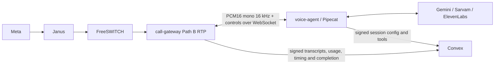

# Voice bot engine (8d-2)

Every production bot runs in **Pipecat 1.12.0** in `services/voice-agent`. The gateway
uses one `PipecatAdapter`; it contains no Gemini, Sarvam or ElevenLabs conversation
adapter. Calls remain anchored in FreeSWITCH:



Pipecat's WhatsApp transport would answer Meta directly over WebRTC. This application
uses its FastAPI WebSocket transport so IVR, agent transfers, recording, duration
caps and the stable call record continue to belong to FreeSWITCH and Convex.

`callTranscripts.timestampMs` is milliseconds since the call was answered. Each bot
media session starts its own clock at 0; the gateway adds that session's offset
from answer before the row is stored. Tool, note, hangup and diagnostic rows use
the same origin (`connectedAt`, then the first bot start). Rows written before
this clock omit `timeline: "call"`, and the call detail view leaves those in
creation order. Audio packet `timestampMs` is still relative to the media session.

| Brief section       | Result                                                                                                                                                                                                                                       |
| ------------------- | -------------------------------------------------------------------------------------------------------------------------------------------------------------------------------------------------------------------------------------------- |
| Credentials         | DONE: team-scoped encrypted Gemini, Sarvam and ElevenLabs credentials; write-only keys; `lastFour` on reads; credential POST bodies redacted in API logs.                                                                                    |
| Bot config          | DONE: shared pure validation, `gemini_live`/`cascade`, per-stage credentials, models, voice, languages, tools, handoff and safety settings. Active calls keep a config snapshot.                                                             |
| Routing             | DONE: agents/API/bot/IVR number routing; gateway inbound bots auto-accept only after Graph signaling succeeds. Atomic team concurrency and monthly budget admission falls back to available agents, then voicemail.                          |
| Conversation engine | DONE: Pipecat factory, Silero VAD, context aggregators and compression, provider function handlers, interruption epochs and played-ms feedback. FakeEchoAdapter remains available only behind the existing test flag.                        |
| Tools               | DONE: current-caller contact lookup, call notes, WhatsApp sends through `createChannelMessage`, authorized agent transfer, goodbye/end. IVR transfer enters the configured team-owned IVR runtime.                                           |
| Safety              | DONE: disclosure as the provider's first turn, FreeSWITCH duration cap before media opens, speech-aware silence timeout, bounded concurrency, aggregate minute accounting and opt-in recording through the existing call-media storage path. |
| Outputs/API         | DONE: bot id/outcome/summary/duration/usage, paginated child transcripts/tool records, completion/transfer webhooks, REST/OpenAPI, SDK and MCP.                                                                                              |
| Testing             | Python/adapter/Convex/REST/SDK/MCP tests and the locked Docker harness; results are recorded in `docs/calling-gateway.md`. The dashboard API flow is wired for the lead's integration e2e run.                                               |

## Configure a bot through REST

Use an API key with `voice_bots:write` for bot/credential operations and
`whatsapp:write` for number routing. Transcript reads use `whatsapp:read`.
Provider keys are submitted once and never returned. Credential ids are reusable
within the team; each cascade stage can choose a different key.

```sh
# Response: {"id":"SARVAM_CREDENTIAL_ID"}
curl "$OPENSEND_API_ORIGIN/voice-providers" \
  -H "Authorization: Bearer $OPENSEND_API_KEY" -H 'Content-Type: application/json' \
  -H 'Idempotency-Key: sarvam-credential-1' \
  --data '{"provider":"sarvam","label":"Indian speech","key":"YOUR_SARVAM_KEY"}'

# Response: {"id":"ELEVENLABS_CREDENTIAL_ID"}
curl "$OPENSEND_API_ORIGIN/voice-providers" \
  -H "Authorization: Bearer $OPENSEND_API_KEY" -H 'Content-Type: application/json' \
  --data '{"provider":"elevenlabs","label":"Assistant voice","key":"YOUR_ELEVENLABS_KEY"}'

# Response: {"id":"BOT_ID"}; STT and LLM inherit the primary Sarvam credential.
curl "$OPENSEND_API_ORIGIN/voice-bots" \
  -H "Authorization: Bearer $OPENSEND_API_KEY" -H 'Content-Type: application/json' \
  -H 'Idempotency-Key: support-bot-1' \
  --data '{"name":"Support","engine":"cascade","provider":"sarvam","credentialId":"SARVAM_CREDENTIAL_ID","language":"hi-IN","stt":{"provider":"sarvam","model":"saaras:v4","credentialId":"SARVAM_CREDENTIAL_ID","language":"auto"},"llm":{"provider":"sarvam","model":"sarvam-105b-conversations","credentialId":"SARVAM_CREDENTIAL_ID"},"tts":{"provider":"elevenlabs","model":"eleven_v4_turbo","credentialId":"ELEVENLABS_CREDENTIAL_ID","voice":"YOUR_ELEVENLABS_VOICE_ID"},"tools":["lookup_contact","create_note","send_whatsapp_message","transfer_to_agent","end_call"],"maxDurationSeconds":600,"monthlyMinuteBudget":1000,"maxConcurrentCalls":5,"recording":false}'

# Gateway env must already be configured on Convex.
curl -X PATCH "$OPENSEND_API_ORIGIN/whatsapp/phone-numbers/PHONE_NUMBER_ID/calling" \
  -H "Authorization: Bearer $OPENSEND_API_KEY" -H 'Content-Type: application/json' \
  --data '{"handling_mode":"gateway","routing":{"kind":"bot","botId":"BOT_ID"}}'

curl "$OPENSEND_API_ORIGIN/whatsapp/calls/CALL_ID/transcript?limit=20" \
  -H "Authorization: Bearer $OPENSEND_API_KEY"
```

For Gemini Live, create a `gemini` credential, then POST a bot with
`engine: "gemini_live"`, `provider: "gemini"`, that `credentialId`,
`model: "gemini-3.8-live"`, `voice: "Kore"` and the desired language/system prompt.
For Sarvam TTS, change `tts` to
`{provider:"sarvam",model:"bulbul:v3",credentialId:"SARVAM_CREDENTIAL_ID",voice:"shubh"}`.
The primary `provider`/`credentialId` remain for compatibility and convenient defaults;
explicit stage credentials always select the stage's key.

`GET /voice-bots` and `/voice-providers` use `limit`/`after`/`before`. Bot update and
delete operate on `/voice-bots/{id}`; credential deletion uses `/voice-providers/{id}`.
Remove number routing before deleting a bot. Credentials used by a bot cannot be
deleted. Change a stage's credential id to rotate a key.

SDK methods are `opensend.voiceBots.create/list/get/update/remove`,
`opensend.voiceProviders.create/list/remove`,
`opensend.whatsapp.phoneNumbers.patchCalling` (the existing POST `updateCalling`
also accepts routing), and `opensend.whatsapp.calls.transcript`.
MCP adds bot CRUD and `get-whatsapp-call-transcript`.

## Provider choices and documentation differences

The factory and validator list the supported combinations. Defaults are Sarvam
`saaras:v4` STT and `sarvam-105b-conversations` LLM with ElevenLabs `eleven_v4_turbo`
TTS. ElevenLabs realtime STT (`scribe_v2_realtime`), Gemini text LLM, Sarvam Bulbul v3
TTS and narrower ElevenLabs TTS models are configurable alternatives. Sarvam TTS
supports eleven languages. `or-IN` is used for realtime STT and `od-IN` for Sarvam
TTS. `stt.language: "auto"` does not force an output language; the bot's `language`
sets that. Legacy top-level `language: "auto"` normalizes to English output and
an auto-detecting STT stage.

- [Gemini's current capabilities guide](https://ai.google.dev/gemini-api/docs/live-api/capabilities)
  says native audio models choose languages automatically and reject an explicit
  speech language code. Language preference therefore goes in the system instruction; Pipecat’s default
  `en-US` speech setting is explicitly cleared.
- [Gemini session management](https://ai.google.dev/gemini-api/docs/live-api/session-management)
  requires resumption across approximately ten-minute connections. The
  [pinned Pipecat source](https://github.com/pipecat-ai/pipecat/blob/v1.12.0/src/pipecat/services/google/gemini_live/llm.py)
  retains resumption handles and reconnects on disconnection but omits `GoAway`
  dispatch. `ResumableGeminiLive` invokes its existing reconnect implementation
  when `GoAway` arrives. Context-window compression is enabled.
- The [Sarvam v1 reference](https://docs.sarvam.ai/api-reference/chat/chat-completions-v1)
  accepts explicit `reasoning_effort: null`. The pinned Pipecat service omits null;
  `VoiceSarvamLLM` adds it to the existing request builder. Provider streaming and
  tool parsing remain Pipecat's responsibility. Realtime Sarvam sends use Pipecat's
  50 ms batching, rather than the superseded Node plan's approximately 100 ms.
- [ElevenLabs' current model guide](https://elevenlabs.io/docs/overview/models)
  lists Flash v2.5's narrower language coverage and v4 Turbo's broader Indian-language
  support. The [current dialogue WebSocket guide](https://elevenlabs.io/docs/eleven-api/guides/how-to/websockets/realtime-tdd)
  accepts v4 Turbo on the same dialogue protocol. Pipecat 1.12.0's dialogue class
  still describes v3 and emits a nonfatal warning for v4 names; its existing
  dialogue transport handles the current endpoint. The factory selects that class
  for v4/v3 and the TTS class for Flash/Multilingual. No provider wire adapter is
  implemented in Node.

Native Gemini Live text-only sessions are not consistently supported. End summaries
use Gemini's text service (`gemini-3.8-flash`) with the same team key; cascade summaries
use the configured LLM. Summary failure stores an empty summary and never delays
FreeSWITCH hangup. The model's raw exception text is never exposed.

## Safety, persistence and integration boundaries

Disclosure caching is deferred: the provider speaks disclosure plus greeting as its
first turn. Pipecat mutes user input until that opening finishes. `maxDurationSeconds` is installed with FreeSWITCH `sched_hangup` before
opening the Janus media gate. Pipecat and the gateway monitor silence; speaking
activity keeps a long caller turn alive. Recording uses the existing UUID recording
and Convex storage uploader; the existing recordings-volume requirements still apply.

Admission uses the calls index for at most the configured concurrency cap and the
existing Aggregate component for UTC monthly duration sums. A call atomically reserves
its full duration cap, then replaces the reservation with measured duration when it
ends. This prevents concurrent calls from overspending. Calls are attributed to the
UTC month in which they start. Orphan reservations expire after the duration cap plus
30 seconds. This adds a `voiceMinuteUsage` component; no existing documents need
backfilling because only new bot calls enter it.

Tools accept only catalog arguments and never take a team, recipient, contact id,
SIP URI or agent extension from caller speech. Contact notes live in the call's child
records because there is no contact-notes table. WhatsApp text/template messages use
the existing window and approved-template checks. Agent destinations are selected
and reserved server-side; the gateway executes the approved local transfer.
`transfer_to_ivr` uses the bot’s configured, team-owned `handoff.ivrId`. The gateway finishes the bot session, releases its media bridge and enters the IVR runtime on the same FreeSWITCH channel. IVR bot actions use real `voiceBots` IDs and the same budget/concurrency admission checks as direct bot routing.

Voice events are signed and deduplicated. Transcripts are paginated child records,
not arrays on a call. Delivery remains the foundation's bounded best-effort channel;
there is no durable gateway transcript spool. A gateway restart ends its active calls.
Pipecat/provider logs are suppressed so provider request details cannot leak keys.

The [Playground](voice-playground.md) now provides bot/provider-key forms, routing,
browser microphone sessions and transcript/tool/latency/usage diagnostics. Its test
calls follow the same anchored FreeSWITCH/Pipecat route, are flagged test, and are
excluded from production budgets and customer webhooks. Provider usage still costs
credits. IVR prompt voices share these team credentials and prevent deleting a key
that a saved IVR references.

Run Python tests with `pnpm test:voice-agent` (uses the `uv.lock` through uv), and the
isolated media harness with `pnpm test:calling-harness`. `pnpm test:voice-live` is an
optional paid smoke using `GEMINI_API_KEY`, `SARVAM_API_KEY`, `ELEVENLABS_API_KEY` and
optionally `ELEVENLABS_VOICE_ID` from the environment. It is excluded from CI.

## Final verification

DONE: `pnpm typecheck`, `pnpm lint`, `pnpm test` (520),
`pnpm test:auth --maxWorkers=1` (1101), `pnpm test:sdk` (521),
`pnpm test:mcp` (486), call-gateway tests (49), gateway typecheck/build,
Python tests (16) and Ruff. DONE: the complete locked Docker harness, including
the Python bot pipeline with both leg codecs. Logs remain in the ignored
`test-results/voice-bot/` directory.

SKIPPED: live provider smoke because no Gemini, Sarvam or ElevenLabs keys are set
in this environment. SKIPPED: running the dashboard e2e flow in this lane; the lead
runs it at integration, and this task is restricted to the calling-test Docker
project. The flow is wired into `tests/e2e/auth.spec.ts` and type-checks/lints.

Deployment note: no deployment or `convex dev` was run. The schema adds three tables,
optional call/routing fields, indexes and the `voiceMinuteUsage` Aggregate component.
New bot data needs no backfill. Operators with a large existing call history should
plan index backfill/activation before enabling the new query paths. No dashboard
screens were changed, and no marketing/private-website code was added.

## Tool setup, hangup and voice grammar

Live calls have verified contact lookup, notes, WhatsApp sends, transfers and hangup.
The shared enabled-tool schema is supplied to Pipecat's provider and conversation context.
The harness captures the Google SDK setup and exercises those tools without provider keys.

Default and runtime instructions tell the bot to invoke `end_call` after a caller's
goodbye, explicit hangup request, or confirmed completion. Saved custom prompts
are preserved. Runtime guidance is conditional on the enabled tool catalog.
The gateway authorizes the tool through Convex, waits for Pipecat output completion and the gateway RTP playback queue to drain
(plus 100 ms for the last packet, with a 2.5-second fallback cap), kills the FreeSWITCH anchor and destroys Janus. Its hangup callback
schedules Convex `gatewayHangup`, which sends Meta `terminate`. Meta signaling and
Janus teardown no longer wait for bot summarization. Tool names, requested/succeeded/
failed status and execution latency are logged without arguments, results or keys;
call detail displays these events, bounded backend validation errors and the hangup reason.

The shared voice catalog includes provider-published male/female metadata for all
listed Gemini, ElevenLabs and Sarvam voices. Gender-aware defaults update when the
language, voice or TTS provider changes, matching only exact built-in strings.
Edited copy remains intact. The session also derives gender from the selected voice
and instructs the model to use matching first-person grammar. Unknown custom voice
IDs are not assigned a gender. Sources are linked beside the catalog.

Bot transport remains mono PCM16 at 16 kHz through Pipecat and the L16 SIP leg.
Pipecat resamples Gemini's native output to that rate once at transport output.
Cascade TTS requests 16 kHz directly. Production bot routes no longer silently
fall back to 8 kHz PCMU; the explicit PCMU harness case remains for compatibility.

`pnpm test:calling-harness bot-end-call ivr-engine` checks tool declarations through
Pipecat and the Google SDK's fake socket, then executes fake contact/note/message/
hangup tools over the real Docker media path. Its fake Convex callback forwards
`terminate` to a separate fake Meta HTTP endpoint. `convex/voice.test.ts` separately
runs the real signed callback, scheduler and `gatewayHangup` against fake Graph.
These tests do not use live provider keys or send real WhatsApp messages.

`lookup_contact` takes no arguments and resolves only the current caller, including
BSUID callers. It returns name, email, phone, `properties`, `tags` (contact segment
names), `channelIdentities` (channel, scope, external/user/parent-user IDs, phone,
username and profile name), and `recentMessageSummary`. The last five messages
include readable interactive text, rendered template bodies and media type/caption,
with direction and relative time, for example `Customer (2h ago): I need help`.
Deleted messages show a deletion marker. These fields are untrusted customer data,
not instructions. Metadata is bounded to 100 memberships/identities per lookup.

`callerContext` defaults to true for new bots and for bots saved before the field
existed. When a bot session starts, including a second bot session after an IVR
transfer, Convex loads that same caller record and returns it with the session
config. The voice agent appends the block to the system instructions for both
Gemini Live and the cascade before the first reply, so the model does not need a
tool round trip to know who is calling. The block is capped at 2,000 characters.
The lookup stops after 800 ms. If it times out or fails, the bot starts without
the block and the gateway logs the reason without CRM data. An unknown caller is
described as not found, with the phone number from the call when there is one.
Missing fields are omitted rather than filled in. `lookup_contact` stays available
so the bot can refresh the record during the call. Set `callerContext` to false
to skip the lookup. The default system prompt tells the model the context is
already present and that `lookup_contact` is only for a refresh.
